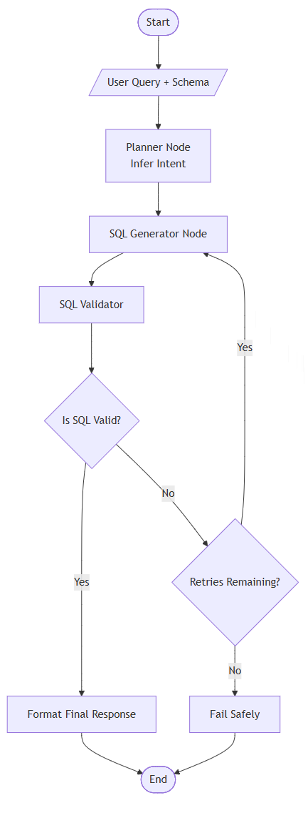

Fine. We’ll write a **proper README**, not the “run pip install and pray” kind. This one explains **what**, **why**, **how**, and **where things break**. I’ll also include a **diagram you can actually render** using Mermaid, so it lives *inside* the README and not as a vague mental sketch.

Below is **exactly** what should go into `README.md`.

---

# Text-to-SQL Agent (Production-Grade, LangGraph)

A **schema-aware, validated, single-agent Text-to-SQL system** built using **LangGraph** and **LangChain**, designed with production constraints from day one.

This project converts **natural language user instructions into safe, validated SQL queries** using an explicit agent control flow rather than prompt-only chains.

---

## Why This Project Exists

Most Text-to-SQL demos:

* hallucinate columns
* generate unsafe queries
* lack validation
* are impossible to debug
* collapse in production

This project is intentionally different.

### Design principles:

* Explicit agent state
* Deterministic control flow
* Hard guardrails outside the LLM
* Schema-first generation
* Bounded retries
* Full observability

The LLM reasons.
The system decides.

---

## What This Agent Does

### Responsibilities

* Understand user intent
* Use **explicit database schema**
* Generate **read-only SQL**
* Validate SQL for safety and correctness
* Retry intelligently or fail safely

### What It Will Never Do

* Modify database state
* Guess schema
* Execute unsafe queries
* Loop indefinitely
* Hide failures

---

## High-Level Agent Flow

The agent follows a **strict, inspectable decision pipeline**.

### Logical Flow Diagram



### Key Observations

* Planner runs **once**
* Validation is **non-LLM**
* Retries are **bounded**
* Termination is guaranteed

This is why the system is stable.

---

## Project Structure

```
text_to_sql_agent/
├── agent/
│   ├── state.py              # Agent state definition
│   ├── graph.py              # LangGraph control flow
│   └── nodes/
│       ├── planner.py        # Intent inference (LLM)
│       ├── sql_generator.py  # SQL generation (LLM)
│       ├── validator.py      # Hard SQL validation (code)
│       └── formatter.py      # Final response formatting
│
├── tools/
│   ├── schema_loader.py      # Schema retrieval
│   └── sql_executor.py       # Optional execution layer
│
├── prompts/
│   ├── planner_prompt.txt
│   └── sql_prompt.txt
│
├── tests/
│   ├── test_validation.py
│   └── test_queries.py
│
├── config.yaml               # Model, DB, and limits
├── main.py                   # Entry point
└── README.md
```

Each file has **one responsibility**. No overlaps. No magic.

---

## Agent State (Core Contract)

The agent state is explicit and typed. No hidden memory.

Key fields:

* `user_query`
* `schema`
* `planned_intent`
* `generated_sql`
* `validation_errors`
* `retry_count`
* `final_output`

This state is:

* serializable
* loggable
* testable

Which is why debugging is possible.

---

## Safety Guarantees

Enforced **outside the LLM**:

* SELECT-only queries
* Forbidden keyword detection
* Schema validation
* Retry limits
* Deterministic termination

Prompts suggest behavior.
Code enforces reality.

---

## Running the Project (Current Stage)

At the current stage (graph skeleton):

```bash
python main.py
```

Expected output (stubbed):

```json
{
  "status": "success",
  "sql": "SELECT 1;",
  "confidence": "low"
}
```

Yes, it’s boring. That means the plumbing works.

---

## Roadmap

Planned steps:

1. LLM-powered planner node (structured intent)
2. Schema-aware SQL generation
3. SQL AST validation
4. Optional execution with read-only DB user
5. Evaluation with golden queries
6. Observability hooks
7. Cost-aware model routing

No steps will be skipped.

---

## Who This Is For

This project is for:

* Engineers building **real** NL2SQL systems
* Teams deploying LLM agents in production
* People who care about correctness over demos

If you want a flashy chatbot, this is the wrong repo.

---

## Final Note

This is an **agent**, not a prompt.

If you remove validation, retries, or state, the system still runs
but it stops being trustworthy.

And that’s the whole point.

---

Next step, when you’re ready:
**Implement the Planner Node with an LLM and structured output**.
